# GameLib App

Es una app desarrollada en Flutter que permite explorar un catálogo de videojuegos utilizando la API REST pública de RAWG(https://rawg.io/apidocs). Permitiendole al usuario cumplir el sueño de tener toda la información sobre sus títulos favoritos en un solo lugar

## Descripción

**GameLib** es una app que permite al usuario:

- Buscar videojuegos por nombre
- Filtrar búsqueda por categorías, consolas, año de lanzamiento y restricción de edad.
- Crear una biblioteca digital personal con todos tus juegos favoritos
- Leer información sobre cada título
- Ver una reseña general del mismo
- Visualizar detalles de cada videojugo como: nombre, descripcion, plataforma, género, año de lanzamiento, reseña y carátula.
- Explorar videojuegos por popularidad y ver recomendaciones que la app te ofrece para jugar.

El proyecto consume la API REST pública de RAWG para mostrar datos reales y actualizados del mundo gamer.

## Pruebas de funcionamiento 
Para validar el correcto funcionamiento de la API de RAWG en la aplicación se realizaron las siguientes pruebas:
- Se consumió el endpoint 'https://api.rawg.io/api/games' con una API KEY pública válida.
- Se mostraron videojuegos populares correctamente en la aplicación.
- Se verificó que se accede al detalle de un juego, mostrando su nombre, imagen y rating.

## Evidencias
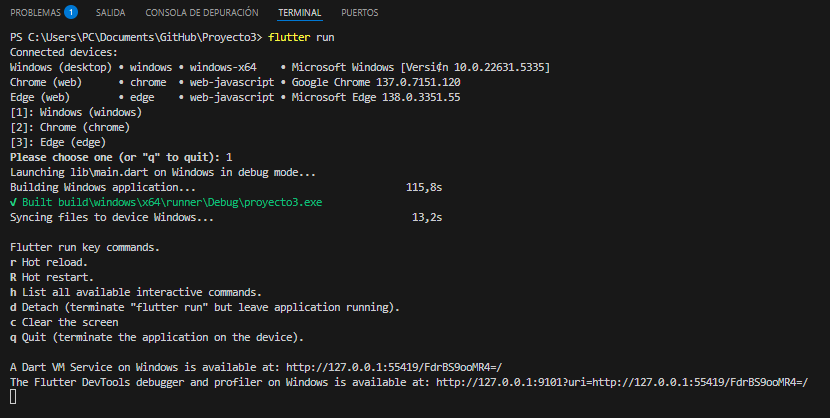 
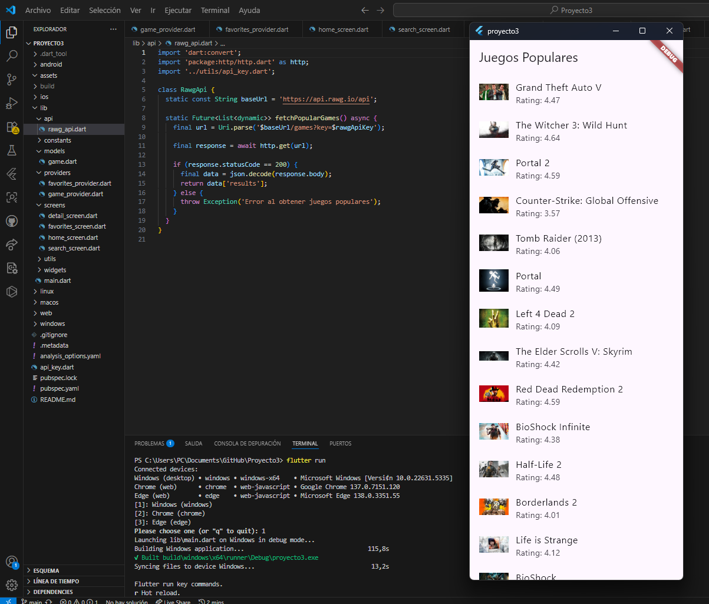

## 📁 Estructura del Proyecto

### 📂 api/
- `rawg_api.dart` – Servicio para consumir la API de RAWG.

### 📂 models/ 
- `game.dart` – Modelo de datos del videojuego.  
*(Representa los objetos que trae la API: Game, Genre, etc.)*

### 📂 providers/
- `game_provider.dart` – Estado de búsqueda y resultados.
- `favorites_provider.dart` – Estado de favoritos.  
*(Uno para los juegos cargados y búsqueda, otro para favoritos.)*

### 📂 screens/
- `home_screen.dart` – Pantalla principal con juegos populares.
- `search_screen.dart` – Pantalla con filtros y resultados de búsqueda.
- `detail_screen.dart` – Pantalla de detalle de un juego.
- `favorites_screen.dart` – Biblioteca personal (favoritos).
- `platform_selection_screen.dart` – Pantalla para seleccionar plataforma.
- `about_screen.dart` – Pantalla de créditos / información de la app.  
*(Separar permite modularidad y navegación clara.)*

### 📂 widgets/
- `game_card.dart` – Widget para mostrar juego en lista.
- `filter_drawer.dart` – Widget para los filtros de búsqueda.
- `search_bar.dart` – Barra de búsqueda.
- `platform_button.dart` – Botón reutilizable para plataformas.
- `custom_text_styles.dart` – Definiciones de estilo de texto.  
*(Componentes reutilizables como tarjetas, buscador, filtros, etc.)*

### 📂 utils/
- `api_key.dart` – Clave privada de la API.

### 📂 constants/
- `filters.dart` – Listas fijas de géneros, edades, plataformas.
  
### 📂 themes/
- `theme.dart` – Estilos personalizados.
- `util.dart` – Funciones auxiliares para el tema.
  
### 📂 assets/
- Evidencias de las pruebas de API.
*(Screenshots de las evidencias, Logo e implementaciones futuras.)*

## Llamada a la API - `rawg_api.dart`
GameLib realiza una solicitud GET a la API pública de "RAWG" para obtener portadas, reseñas y una sinopsis sobre videojuegos populares:

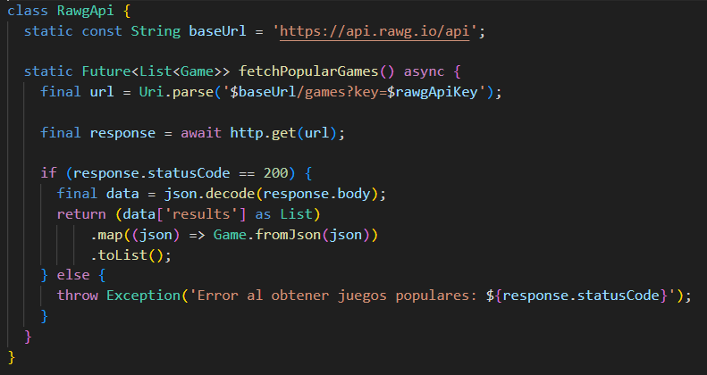

Se usa el paquete HTTP y se convierte el responde.body del JSON a una lista de objetos en Game.dart

## Procesamiento de la respuesta y visualización

La aplicación no imprime la respuesta de la API en la consola, ya que el procesamiento y la validación se realiza directamente en la interfaz gráfica de usuario (Main.dart). Aun así, se valida el `statusCode` en el código, y se transforma el JSON en objetos `Game` antes de mostrarlo en pantalla.

La lista de juegos populares se muestra en pantalla mediante un `ListView.builder`, con widgets personalizados (GameCard) que representan cada juego visualmente:

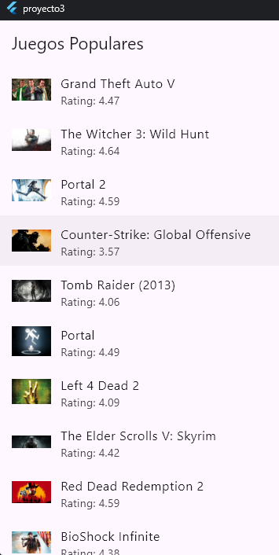

Que tras presionar cada juego de la lista se abrirá toda la información solicitada a la API del juego (Imagen, nombre, rating y descripción)

## Modelo de datos - `models/game.dart`
La respuesta JSON de la API se transforma en objetos del tipo `Game`, utilizando un modelo personalizado en dart, represenando la información de un videojuego de la lista traido desde la API:

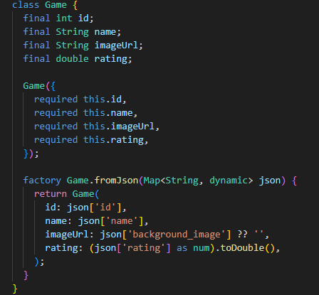

## Visualización de datos contextualizada
Los datos obtenidos desde la API de RAWG se presentan en la app GameLib de manera clara, estructurada y entendible para el usuario. Cada videojuego se muestra mediante un `Card` que contiene:

- Imagen de portada del juego (`background_image`)
- Nombre del videojuego
- Puntuación o rating
- Descripción o Sinopsis

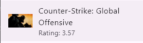

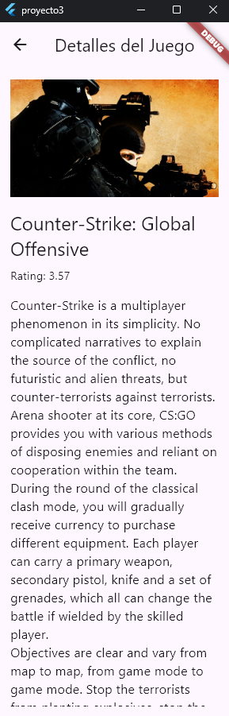

Los juegos se organizan mediante un `ListView`, y cada elemento se presenta utilizando un widget personalizado (`GameCard`), lo que permite dar contexto visual a los datos sin mostrar JSON crudo. Se complementa con pantallas de detalle donde se muestra más información de cada título.

## Pantallas de la Aplicación

Se detallan las pantallas implementadas en la app, cada una con una función específica orientada a mejorar la experiencia de exploración y gestión de los títulos.

---

### Home (Inicio)

La pantalla principal muestra una barra de búsquda (Search Bar) donde el usuario podrá escribir el nombre de un título o seleccionar una de las categhorías para buscar algun videojuego de interés. Más abajo se muestra un carrusel (swiper) con videojuegos populares obtenidos desde la API de RAWG. Debajo se presenta una lista vertical de juegos destacados, cada uno con su imagen, nombre y puntuación. Desde aquí se puede acceder al detalle de cada juego tras pinchar en las imágenes.

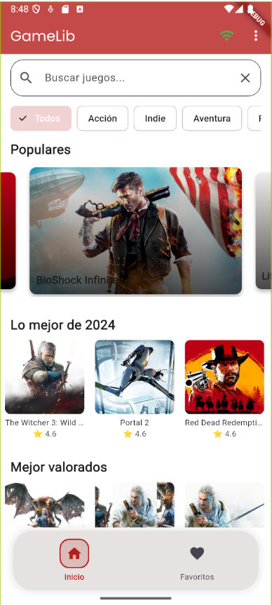

---

### Favoritos

Permite al usuario guardar sus juegos favoritos en una biblioteca personal. Estos juegos se almacenan localmente mediante `SharedPreferences`, por lo que se mantienen entre sesiones. Desde aquí también se puede eliminar favoritos o acceder a su información completa.

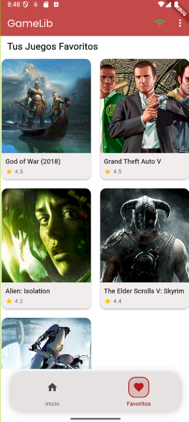

---

### Detalle del Juego

Pantalla que se abre al seleccionar un juego desde cualquier parte de la app. Muestra una imagen ampliada, nombre del título, puntuación, fecha de lanzamiento, compañía distribuidora, descripción completa, plataformas, géneros y capturas de pantalla. Toda esta información es obtenida dinámicamente desde la API.

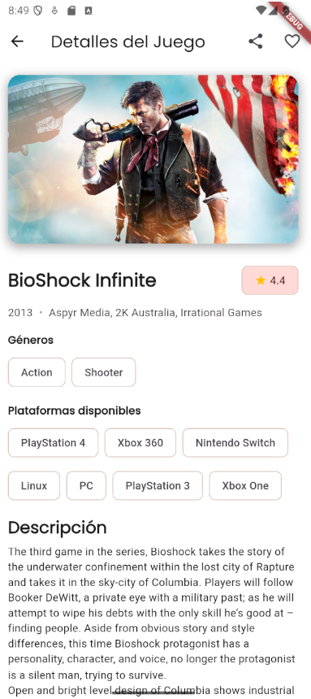

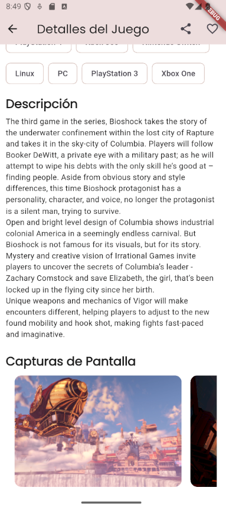

Dentro de esta pantalla tambien podemos encontrar las categorías del juego, si uno pincha cualquiera de las categorías uno puede buscar títulos que compartan dicha similitud, esto es esencial para usuarios que no sepan mucho del mundo de los vidoejuegos y quieran adentrarse a nuevas experiencias de juego basado en títulos del mismo género

En la esquina superior derecha podemos notar 2 botones, el botón de Favoritos y el botón de Compartir.
Si pulsamos el de compartir, se creará un texto con la información con el título del juego, la fecha de lanzamiento, la calificación, y más información en la API que puede ser visitada en la página web

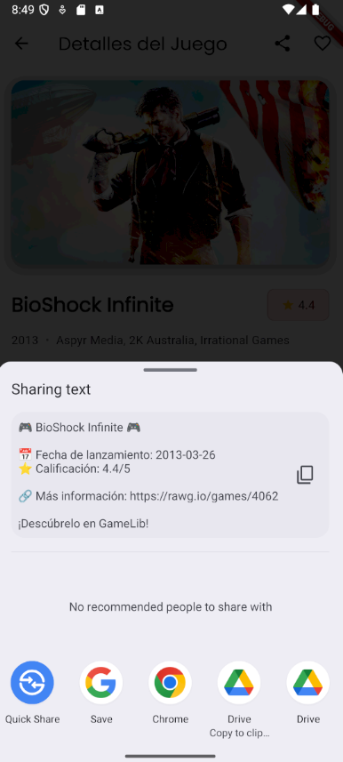

---

### Buscar

Permite realizar búsquedas personalizadas utilizando el endpoint de búsqueda de RAWG. Incluye filtros por:
- Géneros (Accion, aventura, indie, etc)
- Nombre del título
- Preferencias seleccionadas
La lista de resultados se adapta automáticamente a los filtros aplicados.

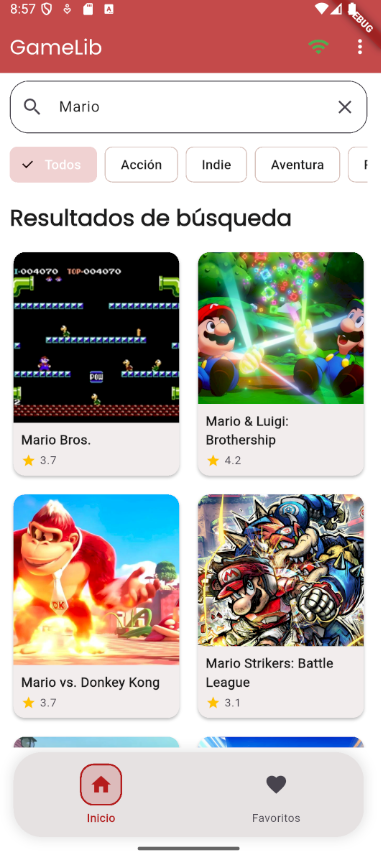

---

### Preferencias

Pantalla pensada para configurar opciones locales del usuario. Aquí se podrían agregar funcionalidades como:
- Preferencia de consola principal (Playstation, Xbox, Nintendo, PC, Ios, Android, etc)
- Modo de visualización (Claro o Oscuro)
Estas configuraciones pueden almacenarse con `SharedPreferences`.

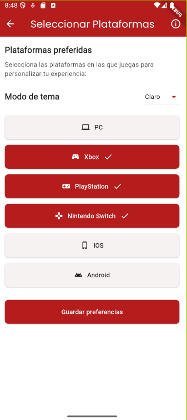

---

### About (Acerca de)

Pantalla informativa sobre la app, los autores del proyecto y enlaces útiles como:
- Página oficial de RAWG
- Repositorio del proyecto en GitHub
- Presentar algun fallo sobre la aplicación

Esta sección sirve para informar al usuario sobre quienes desarrollaron la app y de donde ha sido sacada la información

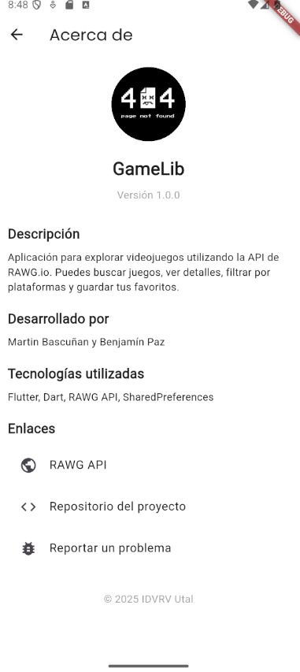

Dentro de esta pantalla podemos observar los enlaces puestos debajo, cada uno tras ser pinchado te llevará a los siguientes links

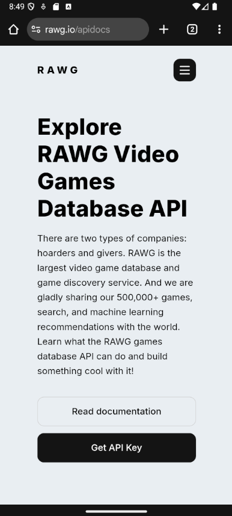

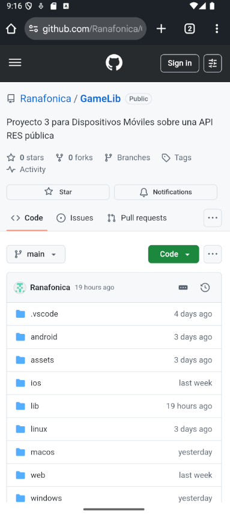

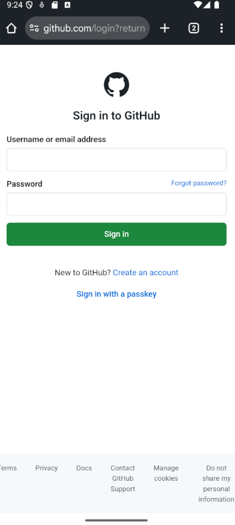

---

### Manejo Offline

Es imprescindible el uso de internet para que la aplicación funcione, por lo tanto, si el usuario no llegase a estar conectado mientras está usando la aplicación, es importante saber manejar dichos casos, es por eso que implementamos el manejo del uso Offline dentro de la aplicación, donde se le notificará de manera visual que le usuario no se encuentra conectado en este momento y para seguir usando la app es necesario que se vuelva a conectar.

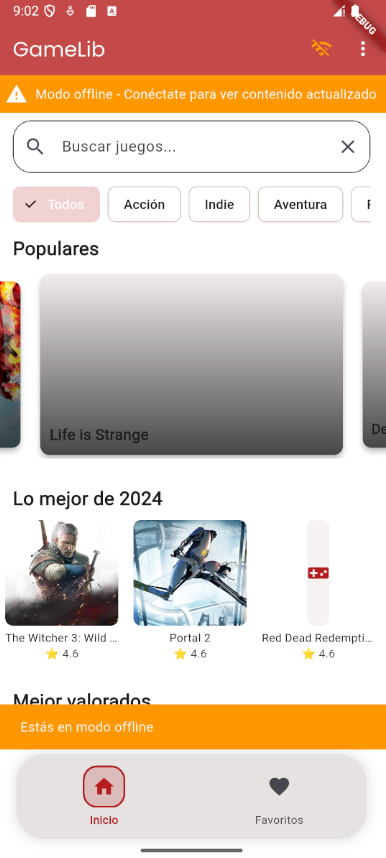

---

## Tema Escogido

GameLib cuenta con un diseño personalizado que adapta su apariencia al modo claro u oscuro escogido en el apartado de "Preferencias". Se ha aplicado un tema consistente a la identidad digital del proyecto con tipografías, colores y espaciado uniforme relacionados al mundo de los videojuegos para mejorar la experiencia visual.

### Modo Claro

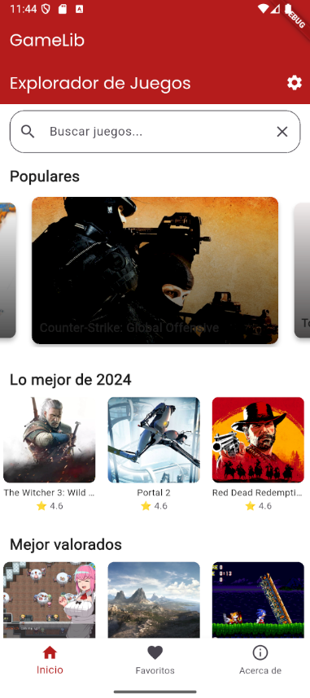

### Modo Oscuro

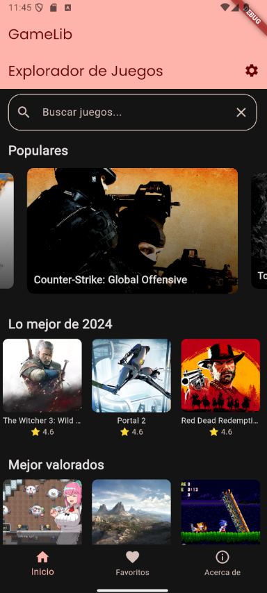

Los temas se gestionan mediante `theme.dart` y `util.dart`, permitiendo un cambio automático (al entrar) o manual (tras ingresar a las "Preferencias") según las preferencias del usuario o del sistema en donde se ejecute la aplicación.

### Diagrama Wireframe

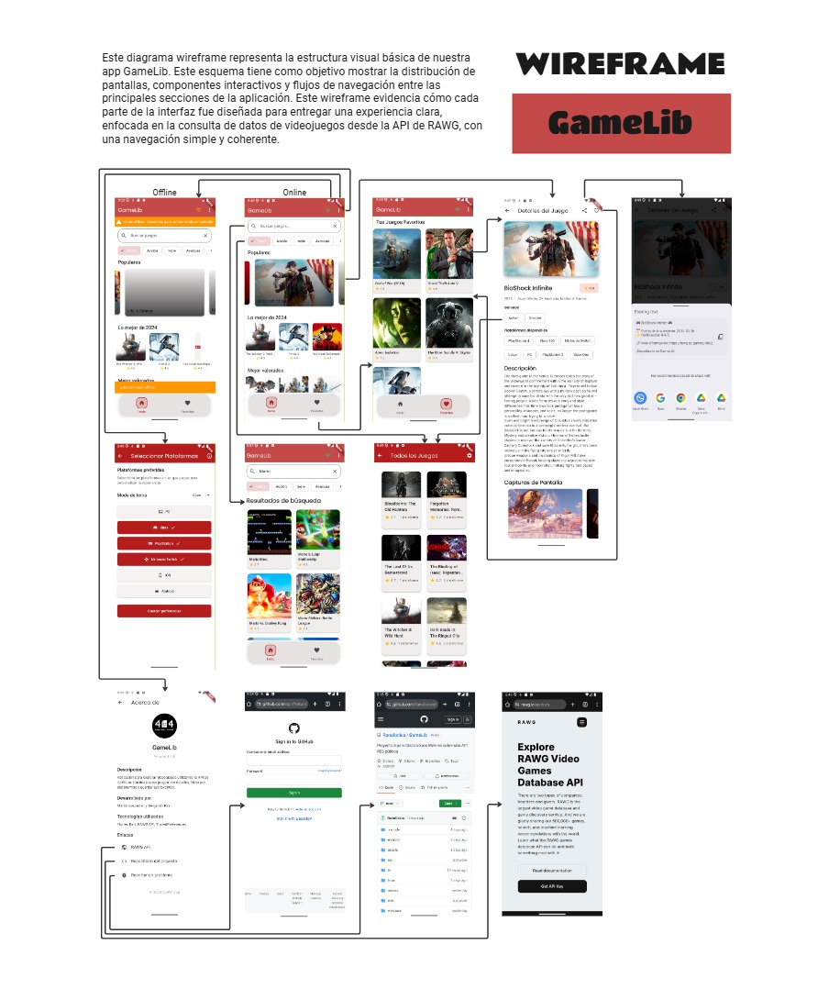

## Lista de Actividades Pendientes para el Cierre del Piloto
La realización de las siguientes actividades puede quedar a cambios dentro del desarrollo de la aplicación, por lo que esta es solamente una referencia actual de las decisiones más bien no un mandato

| Tarea                             | Detalle técnico                                                                  | Responsable     | Estado                 |
|-----------------------------------|----------------------------------------------------------------------------------|-----------------|------------------------|
| Implementar pantalla de detalles  | Mostrar descripción, plataformas, géneros, etc. al hacer clic en un juego        | Benjamín Paz    | OK                     |
| Agregar función de búsqueda       | Buscar juegos por nombre usando query en la API (`?search=`)                     | Martín Bascuñan | OK                     |
| Incorporar filtrado               | Filtrar por año, consola o clasificación (`?platforms=`, `?dates=`, etc.)        | Martín Bascuñan | OK                     |
| Crear biblioteca personal         | Permitir al usuario marcar favoritos/local storage                               | Benjamín Paz    | OK                     |
| Crear Pestañas de navegación      | Permite al usuario navegar entre las pantallas creadas y por crear               | Benjamín Paz    | OK                     |
| Persistencia de Datos             | La información quedará guardada en las sesiones                                  | Martín Bascuñan | OK                     |
| Swiper en Homepage                | Implementar una lista lateral con Swiper que facilite la visual de los juegos    | Benjamín Paz    | OK                     |
| Mejorar diseño visual             | Añadir íconos, márgenes, colores contextuales, tipografías                       | Martín Bascuñan | OK                     |
| Mostrar error de red              | Mostrar mensaje si falla la conexión a la API (`404`, `500`)                     | Martín Bascuñan | OK                     |
| Validación funcional de la API    | Confirmar llamadas exitosas con respuestas válidas y uso correcto de modelos     | Benjamín Paz    | OK                     |
| Evidencias en README              | Adjuntar capturas, fragmentos de código y documentación completa                 | Martín Bascuñan | OK (Actualizado)       |
| Diagrama de Flujo                 | Adjuntar un diagrama que permita evidenciar el flujo de la app                   | Ambos           | OK                     |
| Subida del APK                    | Compilar y generar `.apk` para prueba final                                      | Ambos           | OK                     |
| Presentación del piloto           | Tener la app funcional, mostrar flujo y navegación en video/presentación         | Ambos           | OK                      |

## Tecnologías Utilizadas

- **Flutter 3.x**
- **Dart**
- **HTTP package** (para consumir la API)
- **Provider** (para gestión de estado)
- **SharedPreferences** (para persistencia local de favoritos)
- **RAWG API** (fuente externa de datos)

## API de RAWG

La clave API fue sacada directamente desde la página de RAWG.IO tras crear una cuenta dentro de la página y solicitando acceso a la API KEY que nos permitió trabajar directamente con esta API RES pública.
[https://rawg.io/apidocs](https://rawg.io/apidocs)

