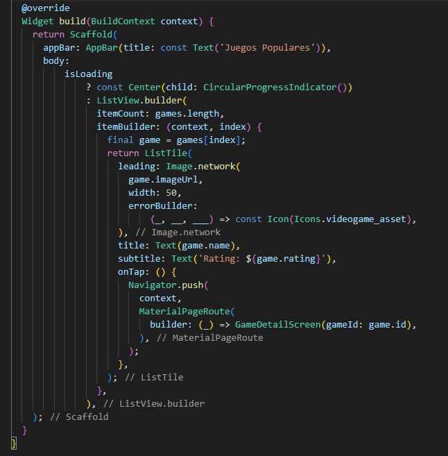

# GameLib App

Es una app desarrollada en Flutter que permite explorar un catálogo de videojuegos utilizando la API REST pública de RAWG(https://rawg.io/apidocs). Permitiendole al usuario cumplir el sueño de tener toda la información sobre sus títulos favoritos en un solo lugar

## Descripción

**GameLib** es una app que permite al usuario:

- Buscar videojuegos por nombre
- Filtrar búsqueda por categorías, consolas, año de lanzamiento y restricción de edad.
- Crear una biblioteca digital personal con todos tus juegos favoritos
- Leer información sobre cada título
- Ver una reseña general del mismo
- Visualizar detalles de cada videojugo como: nombre, descripcion, plataforma, género, año de lanzamiento, reseña y carátula.
- Explorar videojuegos por popularidad y ver recomendaciones que la app te ofrece para jugar.

El proyecto consume la API REST pública de RAWG para mostrar datos reales y actualizados del mundo gamer.

## Pruebas de funcionamiento 
Para validar el correcto funcionamiento de la API de RAWG en la aplicación se realizaron las siguientes pruebas:
- Se consumió el endpoint 'https://api.rawg.io/api/games' con una API KEY pública válida.
- Se mostraron videojuegos populares correctamente en la aplicación.
- Se verificó que se accede al detalle de un juego, mostrando su nombre, imagen y rating.

## Evidencias
 

## Estructura del Proyecto

### 📂 api/
- rawg_api.dart = Servicio para consumir la API de RAWG
### 📂 models/ Representa los objetos que trae la API (Game, Genre, etc.).
- game.dart = Modelo de datos del videojuego.
### 📂 providers/ Uno para los juegos cargados y búsqueda, otro para favoritos.
- game_provider.dart = Estado de búsqueda y resultados.
- favorites_provider.dart = Estado de favoritos.
### 📂 screens/ Separar permite modularidad y navegación clara.
- home_screen.dart = Pantalla principal con juegos populares
- search_screen.dart = Pantalla con filtros y resultados de búsqueda.
- detail_screen.dart = Pantalla de detalle de un juego.
- favorites_screen.dart = Biblioteca personal (favoritos).
### 📂 widgets/ Componentes reutilizables como tarjetas, buscador, filtros, etc.
- game_card.dart = Widget para mostrar juego en lista.
- filter_drawer.dart = Widget para los filtros de búsqueda.
- search_bar.dart = Widget para buscar.
### 📂 utils/ API key
- api_key.dart = Clave privada de la API.
### 📂 constants/ formatos, helpers o listas constantes (como restricciones de edad).
- filters.dart = Listas fijas de géneros, edades, plataformas.
### 📂 assets/
- Evidencias de las pruebas de API
### 📂 themes/
- theme.dart
- util.dart

## Llamada a la API - `rawg_api.dart`
GameLib realiza una solicitud GET a la API pública de "RAWG" para obtener portadas, reseñas y una sinopsis sobre videojuegos populares:

Se usa el paquete HTTP y se convierte el responde.body del JSON a una lista de objetos en Game.dart

## Procesamiento de la respuesta y visualización

La aplicación no imprime la respuesta de la API en la consola, ya que el procesamiento y la validación se realiza directamente en la interfaz gráfica de usuario (Main.dart). Aun así, se valida el `statusCode` en el código, y se transforma el JSON en objetos `Game` antes de mostrarlo en pantalla.

La lista de juegos populares se muestra en pantalla mediante un `ListView.builder`, con widgets personalizados (GameCard) que representan cada juego visualmente:

Que tras presionar cada juego de la lista se abrirá toda la información solicitada a la API del juego (Imagen, nombre, rating y descripción)

## Modelo de datos - `models/game.dart`
La respuesta JSON de la API se transforma en objetos del tipo `Game`, utilizando un modelo personalizado en dart, represenando la información de un videojuego de la lista traido desde la API:

## Visualización de datos contextualizada
Los datos obtenidos desde la API de RAWG se presentan en la app GameLib de manera clara, estructurada y entendible para el usuario. Cada videojuego se muestra mediante un `Card` que contiene:

- Imagen de portada del juego (`background_image`)
- Nombre del videojuego
- Puntuación o rating
- Descripción o Sinopsis
- 

Los juegos se organizan mediante un `ListView`, y cada elemento se presenta utilizando un widget personalizado (`GameCard`), lo que permite dar contexto visual a los datos sin mostrar JSON crudo. Se complementa con pantallas de detalle donde se muestra más información de cada título.

## Lista de Actividades Pendientes para el Cierre del Piloto
La realización de las siguientes actividades puede quedar a cambios dentro del desarrollo de la aplicación, por lo que esta es solamente una referencia actual de las decisiones más bien no un mandato

| Tarea                             | Detalle técnico                                                                  | Responsable     | Estado                 |
|-----------------------------------|----------------------------------------------------------------------------------|-----------------|------------------------|
| Implementar pantalla de detalles  | Mostrar descripción, plataformas, géneros, etc. al hacer clic en un juego        | Martín Bascuñan | En progreso            |
| Agregar función de búsqueda       | Buscar juegos por nombre usando query en la API (`?search=`)                     | Martín Bascuñan | Pendiente              |
| Incorporar filtrado               | Filtrar por año, consola o clasificación (`?platforms=`, `?dates=`, etc.)        | Martín Bascuñan | Pendiente              |
| Crear biblioteca personal         | Permitir al usuario marcar favoritos/local storage                               | Martín Bascuñan | Pendiente              |
| Crear Pestañas de navegación      | Permite al usuario navegar entre las pantallas creadas y por crear               | Martín Bascuñan | Pendiente              |
| Persistencia de Datos             | La información quedará guardada en las sesiones                                  | Martín Bascuñan | Pendiente              |
| Cuentas y uso de FIREBASE         | Permite al usuario crear una cuenta dentro de la app y validar su entrada        | Martín Bascuñan | Pendiente              |
| Mejorar diseño visual             | Añadir íconos, márgenes, colores contextuales, tipografías                       | Martín Bascuñan | En progreso            |
| Mostrar error de red              | Mostrar mensaje si falla la conexión a la API (`404`, `500`)                     | Martín Bascuñan | Pendiente              |
| Validación funcional de la API    | Confirmar llamadas exitosas con respuestas válidas y uso correcto de modelos     | Martín Bascuñan | OK                     |
| Evidencias en README              | Adjuntar capturas, fragmentos de código y documentación completa                 | Martín Bascuñan | OK (Actualizado)       |
| Diagrama de Flujo                 | Adjuntar un diagrama que permita evidenciar el flujo de la app                   | Martín Bascuñan | Pendiente              |
| Subida del APK                    | Compilar y generar `.apk` para prueba final                                      | Martín Bascuñan | Pendiente              |
| Presentación del piloto           | Tener la app funcional, mostrar flujo y navegación en video/presentación         | Martín Bascuñan | Pendiente              |

## Tecnologías Utilizadas

- **Flutter 3.x**
- **Dart**
- **HTTP package** (para consumir la API)
- **Provider** (para gestión de estado)
- **SharedPreferences** (para persistencia local de favoritos)
- **RAWG API** (fuente externa de datos)

## API de RAWG

La clave API fue sacada directamente desde la página de RAWG.IO tras crear una cuenta dentro de la página y solicitando acceso a la API KEY que nos permitió trabajar directamente con esta API RES pública.
[https://rawg.io/apidocs](https://rawg.io/apidocs)

